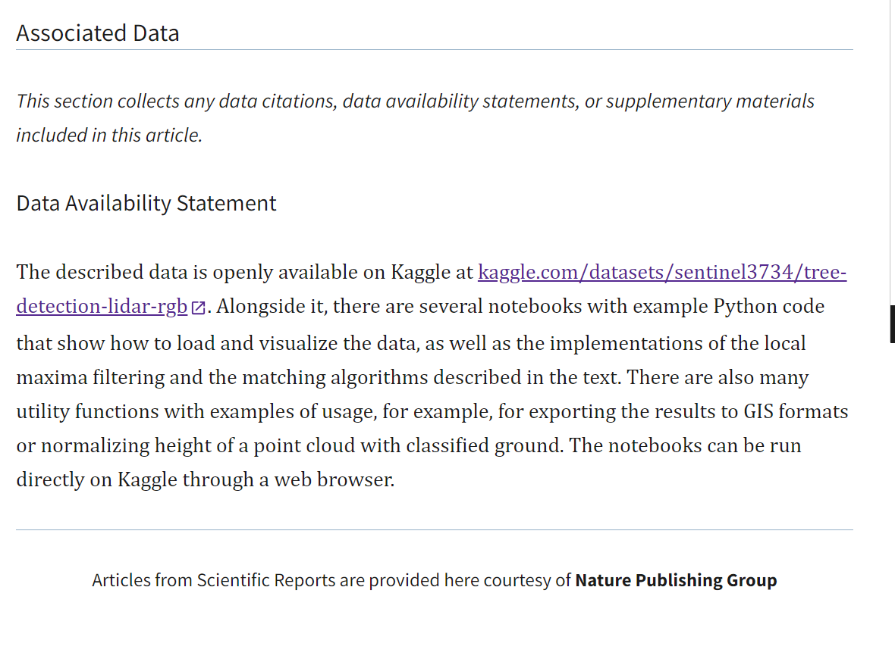

# Data Selection
The project required an open-source, commercially usable outdoor point cloud dataset. Licensing considerations guided the search and selection process. For the selection some constraints are in place. These include finding and validating a commercial-use-permitted open-source outdoor point cloud dataset. The constraints for licensing assisted in searching and selecting the relevant data. The data selection was carried manually ensuring legal compliance, data quality and task relevance.

The manual search step involved searching specialized repositories and platforms using the precise keyword outdoor point cloud semantic segmentation dataset CC-BY commercial use or LiDAR point cloud MIT license. Primary sources of repositories were established after a thorough search. These are listed as follows:
- Hugging Face Datasets Hub (link)
- Hugging Papers with Code (alternative) (link)
- OpenTopography (link)
- Kaggle Datasets (link)

For which the following datasets were selected, based on criterias listed in the requirements of this project, i.e. outdoor scene, of type 3D point cloud and commercially available:

## 1. Sewer Point Clouds (Kaggle)

🔗 https://www.kaggle.com/datasets/aalborguniversity/sewerpointclouds/data

- Contains point clouds of indoor sewer infrastructure, not outdoor vegetation.
- Does not capture trees or forest structures.
- Not relevant for learning outdoor features - e.g. forest species features or forest environments.

Conclusion: Domain mismatch 

## 2. PointCloudPeople (Hugging Face)

🔗 https://huggingface.co/datasets/LukasPro/PointCloudPeople

- Focuses on human body point clouds.
- No vegetation or outdoor forest content.
- Designed for human shape representation, not environmental structure.

Conclusion: Not relevant to tree/forest semantic segmentation.

## 3. ODMSemantic3D (OpenDroneMap)

🔗 https://github.com/OpenDroneMap/ODMSemantic3D

- Primarily a drone photogrammetry semantic dataset, often with building/road segmentation classes.
- Less focused on high‑density LiDAR diverse outdoor scene.
- Often lacks species labels required for training an outdoor segmentation model.

Conclusion: Not suitable for outdoor semantic learning.

## ##4. Velodyne Point Cloud Dataset (Kaggle)

🔗 https://www.kaggle.com/datasets/karimcossentini/velodyne-point-cloud-dataset

- Dataset context is unclear or undocumented.
- Lacks reliable point labels, semantic classes, or structured metadata.
- Uncertain licensing and data quality — requires verification.

Conclusion: Unknown content and license — cannot use for model training or commercial distribution.

## Tree LiDAR-RGB Dataset : 

🔗 https://www.kaggle.com/datasets/sentinel3734/tree-detection-lidar-rgb/code

The dataset chosen dataset meets all required criteria:
- Outdoor environment
- High‑quality LiDAR point clouds
- Diverse species labels or semantic segmentation targets
- Permissive licensing suitable for commercial use
- Structured for deep learning (e.g., point clouds with meaningful labels)

## Evidence of License

N.B. The article states the data is "openly available" and "freely used for research purposes" but doesn't specify a formal license. However, the Data Availability Statement is presented as shown.

 Accessible online at: https://pmc.ncbi.nlm.nih.gov/articles/PMC11415378/
## Summary of Dataset Selection Process:

Several publicly available point cloud datasets were reviewed during data selection, but were excluded because they did not meet the project’s requirements. Indoor or urban datasets (e.g., sewer infrastructure, urban LiDAR) lacked annotations, human body and automotive datasets focus on less diverse structures, and some lacked clear licensing or semantic labels required for training. The final selected tree LiDAR dataset uniquely combines outdoor forest point clouds, species‑level annotations, and permissive licensing, making it well‑suited for semantic segmentation and downstream 3D forest generation.